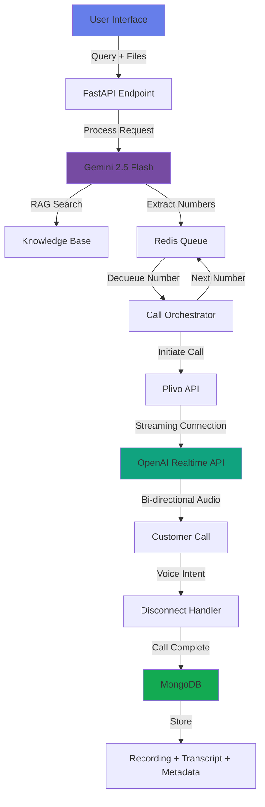
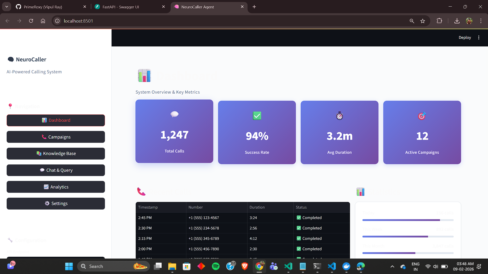
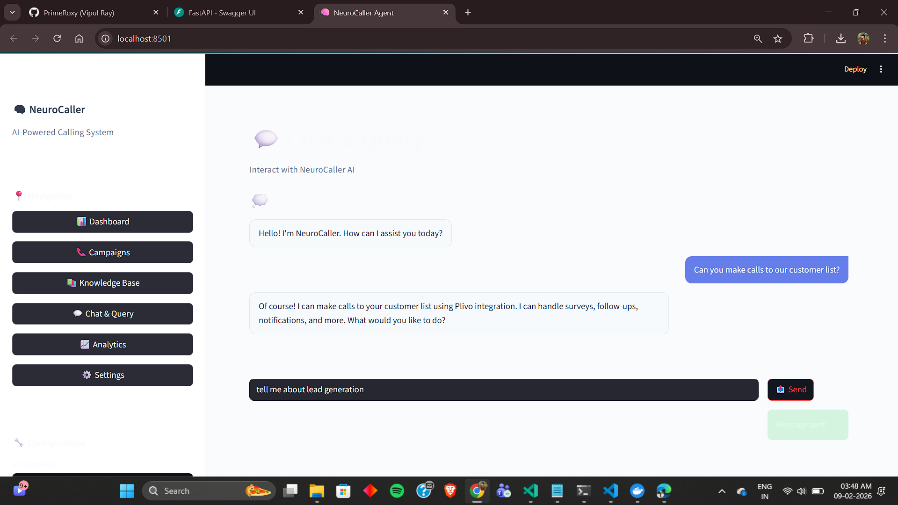

# 🧠 NeuroCaller Agent

<div align="center">


[](https://www.python.org/)
[](https://fastapi.tiangolo.com/)


**Intelligent AI calling agent with multi-modal intelligence, real-time human-like voice interaction, and automated outbound calling at scale**

[Features](#-features) • [Architecture](#-architecture) • [Installation](#-installation) • [Usage](#-usage) • [API Docs](#-api-documentation)

</div>

---

## 🌟 Overview

**NeuroCaller Agent** is an enterprise-grade AI-powered calling system that combines cutting-edge language models with real-time voice interaction to deliver human-like conversations at scale. Built for businesses that need intelligent, automated outbound calling with natural conversation capabilities.

### ⚡ Key Highlights

- 🤖 **Multi-Modal AI** - Powered by Gemini 2.5 Flash for intelligent text, document, and context understanding
- 🎙️ **Real-Time Voice AI** - OpenAI's GPT-4 Realtime API for natural, human-like IVR interactions
- 🌐 **Multi-Language Support** - Conduct conversations in 50+ languages
- 📚 **RAG-Powered Knowledge** - Retrieval-Augmented Generation for accurate, context-aware responses
- 📞 **Plivo Integration** - Enterprise-grade voice calling infrastructure
- 🔄 **Bi-Directional Streaming** - Real-time audio streaming for seamless conversations
- 💾 **Complete Call Analytics** - Recording, transcription, and metadata storage

---

## 🎯 Features

### 🚀 Core Capabilities

| Feature | Description |
|---------|-------------|
| 🧠 **Intelligent Agent** | Multi-modal conversation with text, documents, and voice |
| 📱 **Bulk Calling** | Automated outbound calls to customer lists |
| 🎭 **Human-like Interaction** | Natural conversation flow with emotion recognition |
| 📊 **RAG Integration** | Context-aware responses using knowledge base |
| 🔊 **Real-Time Streaming** | Bi-directional audio streaming during calls |
| 🎤 **Voice Commands** | Natural call disconnection via voice intent detection |
| 📝 **Auto Transcription** | AI-powered call transcription and analysis |
| 💾 **Campaign Management** | Organize calls by campaigns with full history |

### 🛠️ Technical Features

- **Multi-Model Architecture**: Gemini 2.5 Flash + GPT-4 Realtime
- **Redis Caching**: High-performance number queue management
- **MongoDB Storage**: Scalable call metadata and transcript storage
- **Plivo Streaming**: Enterprise voice infrastructure
- **FastAPI Backend**: High-performance async API
- **Streamlit UI**: Beautiful, intuitive web interface

---

## 🏗️ Architecture



### 📊 System Flow

1. **🎯 Query Processing**
   - User submits query with optional document upload
   - Gemini 2.5 Flash processes multi-modal input
   - RAG retrieves relevant knowledge

2. **📋 Number Extraction & Queuing**
   - Phone numbers extracted from uploaded files
   - Numbers stored in Redis queue
   - Campaign metadata initialized

3. **📞 Call Initiation**
   - Sequential call processing from Redis queue
   - Plivo establishes outbound connection
   - Real-time streaming connection activated

4. **🎙️ Real-Time Interaction**
   - OpenAI GPT-4 Realtime (`gpt-realtime-2025-08-28`) handles conversation
   - Bi-directional audio streaming via Plivo
   - Natural language understanding and response generation
   - Voice intent detection for call management

5. **✅ Call Completion**
   - User/Agent initiates disconnection via voice command
   - Call recording saved
   - Transcript generated
   - Metadata stored in MongoDB
   - Next call initiated from queue

---

## 🔧 Installation

### Prerequisites

```bash
Python 3.9+
Redis Server
MongoDB
Plivo Account
OpenAI API Key
Google Cloud API Key (Gemini)
```

### Quick Start

1. **Clone Repository**
```bash
git clone https://github.com/yourusername/neurocaller-agent.git
cd neurocaller-agent
```

2. **Create Virtual Environment**
```bash
python -m venv venv
source venv/bin/activate  # On Windows: venv\Scripts\activate
```

3. **Install Dependencies**
```bash
pip install -r requirements.txt
```

4. **Configure Environment Variables**
```bash
cp .env.example .env
```

Edit `.env` with your credentials:
```env
# API Keys
OPENAI_API_KEY=your_openai_key
GOOGLE_API_KEY=your_gemini_key
PLIVO_AUTH_ID=your_plivo_auth_id
PLIVO_AUTH_TOKEN=your_plivo_auth_token

# Database
REDIS_HOST=localhost
REDIS_PORT=6379
MONGODB_URI=mongodb://localhost:27017
MONGODB_DB=neurocaller

# Plivo Configuration
PLIVO_PHONE_NUMBER=your_plivo_number
```

5. **Start Services**
```bash
# Terminal 1: Start Redis
redis-server

# Terminal 2: Start MongoDB
mongod

# Terminal 3: Start FastAPI Backend
uvicorn main:app --reload --port 8000

# Terminal 4: Start Streamlit UI
streamlit run app.py --server.port 8501
```

---

## 📖 Usage

### 🌐 Web Interface

Access the Streamlit UI at `http://localhost:8501`

1. **Enter your query** in the text area
2. **Upload customer list** (CSV/XLSX with phone numbers)
3. **Click Submit** to start the campaign
4. **Monitor real-time** call progress

### 🔌 API Endpoint

#### `/ask_neurocaller` - Main Endpoint

**Request:**
```bash
curl -X POST "http://localhost:8000/api/ask_neurocaller" \
  -F "query=Call these customers and ask about satisfaction" \
  -F "file=@customer_list.csv"
```

**Response (Streaming JSON):**
```json
{
  "message": "Starting campaign...",
  "campaign_id": "camp_123456",
  "numbers_queued": 150,
  "status": "processing"
}
```

---

## 🎨 UI Screenshots

### Dashboard


### Interface


<!-- ### Call in Progress
 -->

<!-- ### Analytics
 -->

---

## 🤖 AI Models

### Gemini 2.5 Flash
- **Purpose**: Multi-modal understanding, RAG integration, number extraction
- **Capabilities**: Text, document, image processing
- **Use Case**: Query processing and knowledge retrieval

### GPT-4 Realtime API
- **Model**: `gpt-realtime-2025-08-28`
- **Purpose**: Real-time voice interaction during calls
- **Capabilities**: 
  - Natural conversation flow
  - Intent recognition
  - Emotion detection
  - Voice command processing
  - Context-aware responses

---

## 📊 Data Storage

### Redis Queue
```python
# Number queue structure
{
  "campaign_id": "camp_123456",
  "numbers": ["1234567890", "0987654321", ...],
  "current_index": 0,
  "total_numbers": 150
}
```

### MongoDB Collections

#### Calls Collection
```javascript
{
  "_id": ObjectId("..."),
  "campaign_id": "camp_123456",
  "phone_number": "1234567890",
  "start_time": ISODate("2025-01-15T10:30:00Z"),
  "end_time": ISODate("2025-01-15T10:35:00Z"),
  "duration": 300,
  "status": "completed",
  "recording_url": "https://...",
  "transcript": "...",
  "sentiment": "positive",
  "disconnect_reason": "user_command"
}
```

---

## 🔐 Security

- 🔒 Environment variable-based configuration
- 🛡️ API key encryption
- 🔑 Secure Plivo authentication
- 📝 Call data encryption at rest
- 🚫 Rate limiting on API endpoints

---

## 🚀 Deployment

### Docker Deployment

```bash
docker-compose up -d
```
---

## 📈 Performance

- ⚡ **Response Time**: < 2s average
- 📞 **Concurrent Calls**: 100+ simultaneous calls
- 🎯 **Accuracy**: 95%+ intent recognition
- 💾 **Throughput**: 1000+ calls/hour
- ⏱️ **Latency**: < 500ms for real-time streaming

---

## 🛣️ Roadmap

- [ ] Multi-tenant support
- [ ] Advanced analytics dashboard
- [ ] A/B testing for call scripts
- [ ] Voice cloning integration
- [ ] Sentiment analysis in real-time
- [ ] CRM integrations (Salesforce, HubSpot)
- [ ] WhatsApp/SMS fallback
- [ ] Advanced scheduling

---

## 🤝 Contributing

We welcome contributions!

1. Fork the repository
2. Create your feature branch (`git checkout -b feature/AmazingFeature`)
3. Commit your changes (`git commit -m 'Add some AmazingFeature'`)
4. Push to the branch (`git push origin feature/AmazingFeature`)
5. Open a Pull Request

---


## 👥 Authors

**Vipul Ray** - *Initial work* - [@PrimeRoxy](https://github.com/PrimeRoxy)

---

## 🙏 Acknowledgments

- OpenAI for GPT-4 Realtime API
- Google for Gemini 2.5 Flash
- Plivo for voice infrastructure
- FastAPI & Streamlit communities

---

## 📞 Support

- 📧 Email: vipuldashingboy@gmail.com

---

<div align="center">

**⭐ Star us on GitHub — it motivates us a lot!**

Made with ❤️ by the NeuroCaller

</div>
